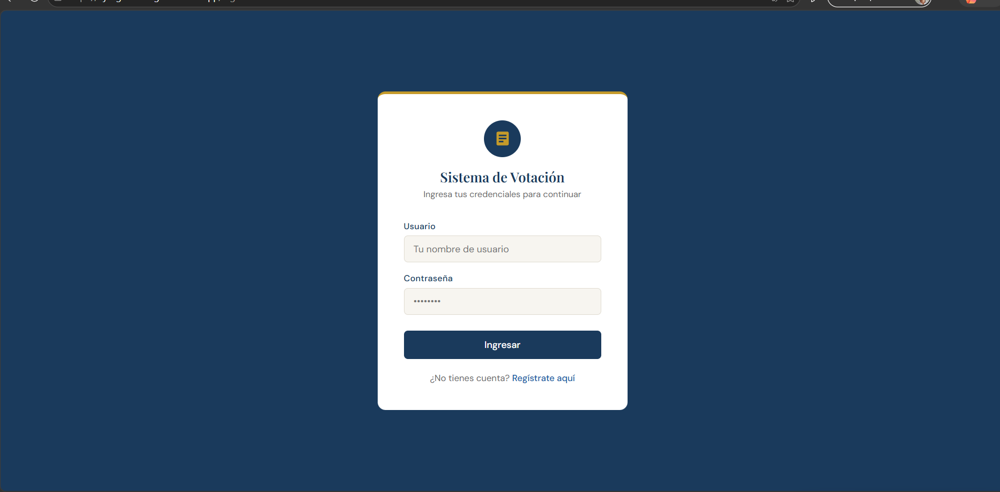
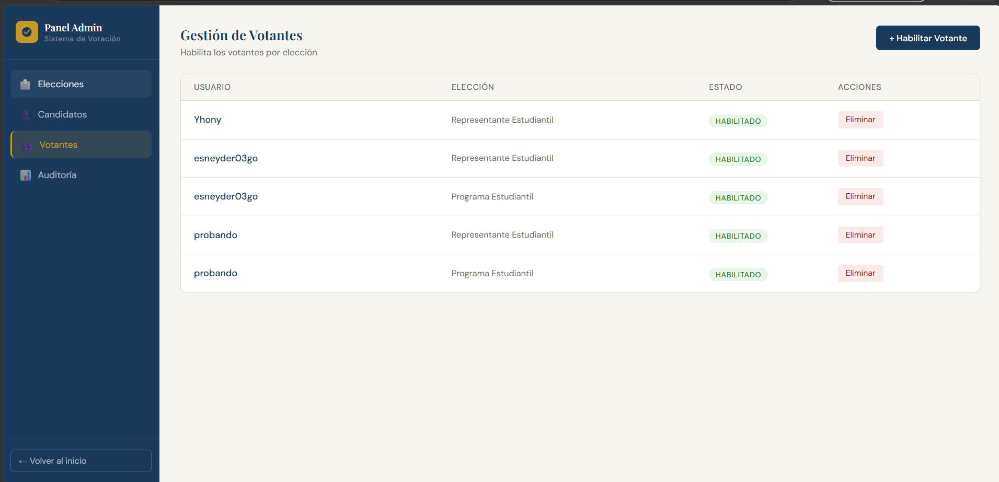

# Sistema de Votación

Profe, este es nuestro sistema de votación. Aquí adjuntamos todo lo solicitado en el entregable 7.

## Capturas

*A continuación se presentan pantallas del sistema en funcionamiento:*

- **Pantalla de Inicio de Sesión:**
  

- **Panel Administrativo - Gestión de Elecciones:**
  

- **Panel Administrativo - Gestión de Candidatos:**
  

- **Panel Administrativo - Gestión de Votantes:**
  

- **Panel Administrativo - Auditoría Electoral:**
  

## Endpoints Probados

Se adjuntan pantallazos de las pruebas realizadas en Postman, donde todas nos retornan código 200 (o 201 de éxito), por lo que podemos confirmar que los endpoints están funcionando correctamente:
- 
- 
- 
- 
- 

## ¿Cómo correr el proyecto, profe?

Profe, para poder revisar el proyecto en su compu, va a necesitar tener instalado **Python** y **Node.js**. Aquí le dejamos los pasitos rápidos:

### 1. Bajar el código
```bash
git clone https://github.com/Joners14/proyectoaulaTendencias20261.git
cd proyectoaulaTendencias20261
```

### 2. Prender el Backend (nuestra API en Django)
Abra una terminal ahí en la carpeta y ejecute esto para instalar lo de Python y levantar el server:
```bash
cd sistemVotacion

# Instalamos las librerías
pip install -r requirements.txt

# Preparamos la base de datos
python manage.py migrate

# Prendemos el servidor
python manage.py runserver
```
*(Con esto el backend ya queda funcionando en `http://localhost:8000`)*

### 3. Prender el Frontend (las pantallas en React)
Ahora abra **otra terminal** distinta, también en la carpeta principal, y corra esto:
```bash
cd frontend

# Instalamos los paquetes de Node
npm install

# Levantamos la vista
npm run dev
```
*(El frontend le va a cargar normalmente en `http://localhost:5173` o el puerto que le salga ahí)*

## Datos para que pruebe el sistema

Le dejamos un usuario administrador ya listo para que pueda entrar y probar todo rápido sin tener que registrarse:

| Rol | Usuario / Email | Contraseña |
|---|---|---|
| **Administrador** | `admin` | `admin` |

## Enlaces de Producción (Proyecto Desplegado)

Profe, por si prefiere no correrlo localmente, también le dejamos el proyecto ya subido a internet para que lo revise directamente:

- **Frontend (Interfaz):** [https://django-front-gules.vercel.app/login](https://django-front-gules.vercel.app/login)
- **Backend (API / Panel Admin):** [https://django-bak.vercel.app/admin/login/?next=/admin/](https://django-bak.vercel.app/admin/login/?next=/admin/)

*Nota: La base de datos que estamos usando es PostgreSQL y se encuentra alojada y desplegada en un servidor VPS.*
